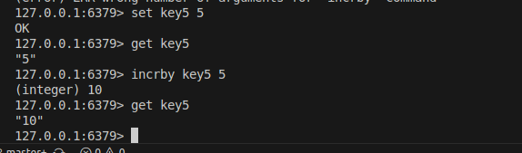

# Домашнее задание к занятию 2 ««Кеширование Redis/memcached» Шелухин Юрий

### Задание 1. Кеширование 

Приведите примеры проблем, которые может решить кеширование. 
*Приведите ответ в свободной форме.*

---

# Решение 1.
1. Кэширование позволяет решить проблемы повышения производительности, в т.ч. увеличения скорости ответа, экономии ресурсов, выравнивания пиков трафика. Этоьдостигается за счёт использования сохранённых ранее данных, например:    
- сервер хранит готовые данные, например, сгенерированные HTML-страницы или результаты частых запросов к базе данных;  
- сети доставки контента (CDN) хранят копии вашего контента (картинки, видео) на серверах по всему миру. Пользователь получает данные с ближайшего сервера, что ускоряет загрузку;  
- результаты одинаковых запросов к базе данных сохраняются, чтобы не выполнять их повторно.

---

### Задание 2. Memcached
Установите и запустите memcached.
*Приведите скриншот systemctl status memcached, где будет видно, что memcached запущен.*

# Решение 2.
sudo apt install memcached  
     

---

### Задание 3. Удаление по TTL в Memcached  
Запишите в memcached несколько ключей с любыми именами и значениями, для которых выставлен TTL 5. 
*Приведите скриншот, на котором видно, что спустя 5 секунд ключи удалились из базы.*

---

# Решение 3.
telnet localhost 11211  
  
     

---

### Задание 4. Запись данных в Redis
Запишите в Redis несколько ключей с любыми именами и значениями. 
*Через redis-cli достаньте все записанные ключи и значения из базы, приведите скриншот этой операции.*

---

# Решение 4.
sudo apt install redis  
redis-cli  
    

---

### Задание 5*. Работа с числами 
Запишите в Redis ключ key5 со значением типа "int" равным числу 5. Увеличьте его на 5, чтобы в итоге в значении лежало число 10.  
*Приведите скриншот, где будут проделаны все операции и будет видно, что значение key5 стало равно 10.*

# Решение 5*.
redis-cli  
  

Тип ключа не задавался, так как по умолчанию ключи в Redis представлены как строки (String), и целочисленные значения хранятся в них в виде строк.
  
---
